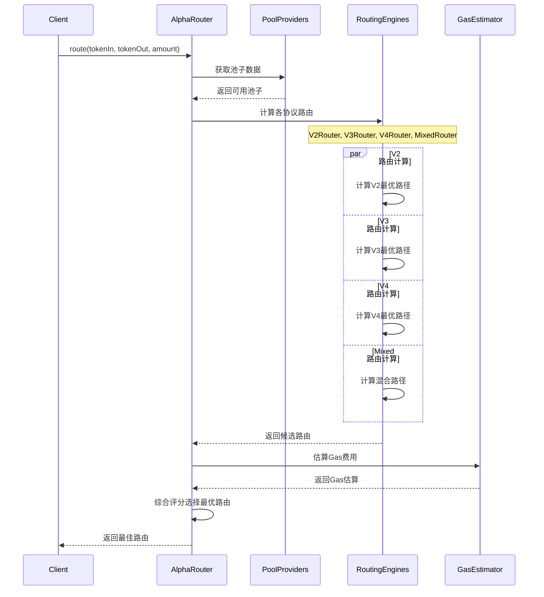

# Smart Order Router 核心

## 概述

Smart Order Router (SOR) 是 Uniswap Routing API 的核心组件，负责在多个流动性协议中寻找最优交易路径。它是一个复杂的算法引擎，需要考虑价格、流动性、Gas费用、价格影响等多个因素来为用户提供最佳的交易执行方案。

## 核心架构

### 🧠 AlphaRouter 主引擎

AlphaRouter 是 SOR 的主要入口点，协调各个子路由器的工作：

```typescript
// lib/handlers/injector-sor.ts 中的关键配置
export class InjectorSOR extends Injector<ContainerInjected, RequestInjected<IRouter<any>>, void, QuoteQueryParams> {
  
  async buildContainerInjected(): Promise<ContainerInjected> {
    // 初始化各种提供商
    const tokenListProvider = await CachingTokenListProvider.fromTokenListURI(
      chainId,
      WRAPPED_NATIVE_CURRENCY[chainId]
    );
    
    const multicallProvider = new UniswapMulticallProvider(chainId, provider);
    
    // V2 协议提供商
    const v2PoolProvider = new V2PoolProvider(
      chainId,
      multicallProvider,
      tokenValidatorProvider,
      tokenPropertiesProvider
    );
    
    // V3 协议提供商  
    const v3PoolProvider = new V3PoolProvider(chainId, multicallProvider);
    
    // V4 协议提供商
    const v4PoolProvider = new V4PoolProvider(chainId, multicallProvider);
    
    // Alpha Router 核心
    const router = new AlphaRouter({
      chainId,
      provider,
      multicallProvider,
      v2PoolProvider,
      v3PoolProvider, 
      v4PoolProvider,
      // ... 其他配置
    });
    
    return { router };
  }
}
```

### 🔄 路由计算流程



## 路由算法详解

### 🎯 V2 路由算法

V2协议使用简单的恒定乘积公式 `x * y = k`：

```typescript
// 来自 @uniswap/smart-order-router 的 V2 路由逻辑
export class V2Router {
  async getRoutes(
    tokenIn: Token,
    tokenOut: Token,
    amount: CurrencyAmount<Currency>,
    tradeType: TradeType
  ): Promise<V2Route[]> {
    
    // 1. 获取所有可能的交易对
    const pairs = await this.getAllPairs(tokenIn, tokenOut);
    
    // 2. 计算直接路由
    const directRoutes = this.getDirectRoutes(pairs, tokenIn, tokenOut);
    
    // 3. 计算多跳路由（通过中介代币）
    const multiHopRoutes = this.getMultiHopRoutes(pairs, tokenIn, tokenOut);
    
    // 4. 对所有路由进行评分
    return this.scoreAndSortRoutes([...directRoutes, ...multiHopRoutes]);
  }
  
  private calculateAmountOut(
    amountIn: BigNumber,
    reserveIn: BigNumber,
    reserveOut: BigNumber
  ): BigNumber {
    // V2 恒定乘积公式计算
    const amountInWithFee = amountIn.mul(997); // 0.3% 手续费
    const numerator = amountInWithFee.mul(reserveOut);
    const denominator = reserveIn.mul(1000).add(amountInWithFee);
    return numerator.div(denominator);
  }
}
```

### 🎯 V3 路由算法

V3引入了集中流动性的概念，计算更加复杂：

```typescript
export class V3Router {
  async getRoutes(
    tokenIn: Token,
    tokenOut: Token,
    amount: CurrencyAmount<Currency>
  ): Promise<V3Route[]> {
    
    // 1. 获取所有费率档位的池子
    const pools = await this.getPoolsForAllFees(tokenIn, tokenOut);
    
    // 2. 为每个池子计算报价
    const quotes = await Promise.all(
      pools.map(pool => this.getQuoteForPool(pool, amount))
    );
    
    // 3. 考虑tick范围和流动性分布
    return this.optimizeForConcentratedLiquidity(quotes);
  }
  
  private getQuoteForPool(pool: V3Pool, amountIn: CurrencyAmount<Token>) {
    // V3 集中流动性计算
    // 需要考虑当前tick、价格范围、流动性密度等
    return pool.getOutputAmount(amountIn);
  }
}
```

### 🎯 V4 路由算法

V4 引入了钩子系统，支持自定义逻辑：

```typescript
export class V4Router {
  async getRoutes(
    tokenIn: Token,
    tokenOut: Token,
    amount: CurrencyAmount<Currency>
  ): Promise<V4Route[]> {
    
    // 1. 识别支持的钩子合约
    const hooksEnabledPools = await this.getHooksEnabledPools(tokenIn, tokenOut);
    
    // 2. 考虑钩子对价格的影响
    const quotesWithHooks = await this.calculateQuotesWithHooks(hooksEnabledPools, amount);
    
    // 3. 优化路径选择
    return this.optimizeV4Routes(quotesWithHooks);
  }
}
```

### 🎯 混合路由算法

Mixed Route 可以在单个交易中组合多个协议：

```typescript
export class MixedRouter {
  async getRoutes(
    tokenIn: Token,
    tokenOut: Token,
    amount: CurrencyAmount<Currency>
  ): Promise<MixedRoute[]> {
    
    // 1. 构建协议图
    const protocolGraph = await this.buildProtocolGraph(tokenIn, tokenOut);
    
    // 2. 使用图算法寻找最优路径
    const candidatePaths = this.findOptimalPaths(protocolGraph, amount);
    
    // 3. 评估混合路径的Gas成本和价格影响
    return this.evaluateMixedPaths(candidatePaths);
  }
  
  private buildProtocolGraph(tokenIn: Token, tokenOut: Token) {
    // 构建包含V2、V3、V4池子的图结构
    // 每个节点是代币，每条边是可用的池子
    return {
      nodes: new Set([tokenIn, tokenOut, ...intermediateTokens]),
      edges: [...v2Pools, ...v3Pools, ...v4Pools]
    };
  }
}
```

## 路由缓存机制

### 📦 缓存策略

路由API实现了多层缓存来提高性能：

```typescript
// lib/handlers/router-entities/route-caching/dynamo-route-caching-provider.ts
export class DynamoRouteCachingProvider extends IRouteCachingProvider {
  
  async getCachedRoute(
    chainId: ChainId,
    amount: CurrencyAmount<Currency>,
    quoteCurrency: Currency,
    tradeType: TradeType,
    protocols: Protocol[]
  ): Promise<CachedRoutes | undefined> {
    
    // 1. 生成缓存键
    const cacheKey = this.generateCacheKey(
      chainId, amount, quoteCurrency, tradeType, protocols
    );
    
    // 2. 查询DynamoDB
    const cachedData = await this.dynamoDb.query({
      TableName: this.tableName,
      KeyConditionExpression: 'pairTradeTypeChainId = :key',
      ExpressionAttributeValues: { ':key': cacheKey }
    }).promise();
    
    // 3. 验证缓存新鲜度
    if (this.isCacheExpired(cachedData, currentBlockNumber)) {
      return undefined;
    }
    
    // 4. 反序列化路由数据
    return CachedRoutesMarshaller.unmarshal(cachedData.Item);
  }
  
  async setCachedRoute(
    cachedRoutes: CachedRoutes,
    amount: CurrencyAmount<Currency>
  ): Promise<boolean> {
    
    // 1. 序列化路由数据
    const marshalledRoutes = CachedRoutesMarshaller.marshal(cachedRoutes);
    
    // 2. 计算过期时间
    const ttl = Math.floor(Date.now() / 1000) + this.blocksToLive * 15; // 15秒/块
    
    // 3. 存储到DynamoDB
    await this.dynamoDb.put({
      TableName: this.tableName,
      Item: {
        ...marshalledRoutes,
        ttl: ttl
      }
    }).promise();
    
    return true;
  }
}
```

### 🗂️ 缓存分桶策略

```typescript
// lib/handlers/router-entities/route-caching/model/cached-routes-strategy.ts
export class CachedRoutesStrategy {
  
  constructor(
    private chainId: ChainId,
    private buckets: number[] // [1000, 10000, 100000] USDC
  ) {}
  
  getBucket(amount: CurrencyAmount<Currency>): [number, number] {
    const amountNumber = parseFloat(amount.toExact());
    
    // 找到合适的金额桶
    for (let i = 0; i < this.buckets.length; i++) {
      if (amountNumber <= this.buckets[i]) {
        const min = i === 0 ? 0 : this.buckets[i-1];
        return [min, this.buckets[i]];
      }
    }
    
    // 超大金额使用最大桶
    return [this.buckets[this.buckets.length-1], -1];
  }
  
  shouldCache(route: Route, amount: CurrencyAmount<Currency>): boolean {
    // 缓存策略判断
    return (
      this.isPopularPair(route.tokenPath) &&
      this.isReasonableAmount(amount) &&
      this.hasGoodLiquidity(route)
    );
  }
}
```

## Gas 优化

### ⛽ Gas 估算

```typescript
// lib/util/estimateGasUsed.ts
export function adhocCorrectGasUsed(
  gasUsed: BigNumber,
  route: Route,
  optimisticGasEstimate: boolean = false
): BigNumber {
  
  let gasUsedCorrection = BigNumber.from(0);
  
  // V2 路由Gas消耗估算
  if (route.protocol === Protocol.V2) {
    gasUsedCorrection = gasUsedCorrection.add(V2_SWAP_GAS_USED);
  }
  
  // V3 路由Gas消耗估算（考虑tick crossing）
  if (route.protocol === Protocol.V3) {
    const tickCrossings = estimateTickCrossings(route);
    gasUsedCorrection = gasUsedCorrection
      .add(V3_SWAP_GAS_USED)
      .add(tickCrossings.mul(TICK_CROSSING_GAS));
  }
  
  // 混合路由额外开销
  if (route.protocol === Protocol.MIXED) {
    gasUsedCorrection = gasUsedCorrection.add(MIXED_ROUTE_GAS_OVERHEAD);
  }
  
  return optimisticGasEstimate 
    ? gasUsed.add(gasUsedCorrection.mul(80).div(100)) // 乐观估算
    : gasUsed.add(gasUsedCorrection.mul(120).div(100)); // 保守估算
}
```

### 🎯 Gas 价格获取

```typescript
// lib/util/gasLimit.ts
export async function getGasPrice(
  provider: JsonRpcProvider,
  chainId: ChainId
): Promise<BigNumber> {
  
  switch (chainId) {
    case ChainId.MAINNET:
      // 以太坊主网使用 EIP-1559
      const feeData = await provider.getFeeData();
      return feeData.gasPrice || feeData.maxFeePerGas!;
      
    case ChainId.POLYGON:
      // Polygon 使用传统 Gas 定价
      return provider.getGasPrice();
      
    case ChainId.ARBITRUM_ONE:
      // Arbitrum 需要考虑 L1 Gas 费用
      const arbGasPrice = await provider.getGasPrice();
      const l1BaseFee = await getArbitrumL1BaseFee(provider);
      return arbGasPrice.add(l1BaseFee);
      
    default:
      return provider.getGasPrice();
  }
}
```

## 价格影响计算

### 📊 价格影响公式

```typescript
// 价格影响计算
export function calculatePriceImpact(
  inputAmount: CurrencyAmount<Currency>,
  outputAmount: CurrencyAmount<Currency>,
  tradeType: TradeType
): number {
  
  if (tradeType === TradeType.EXACT_INPUT) {
    // 精确输入模式
    const executionPrice = outputAmount.divide(inputAmount);
    const marketPrice = getMarketPrice(inputAmount.currency, outputAmount.currency);
    
    return (marketPrice.subtract(executionPrice))
      .divide(marketPrice)
      .multiply(100)
      .toNumber();
  } else {
    // 精确输出模式  
    const executionPrice = inputAmount.divide(outputAmount);
    const marketPrice = getMarketPrice(inputAmount.currency, outputAmount.currency);
    
    return (executionPrice.subtract(marketPrice))
      .divide(marketPrice)
      .multiply(100)
      .toNumber();
  }
}
```

## 性能监控

### 📈 关键指标

```typescript
// lib/handlers/quote/quote.ts 中的性能监控
export class QuoteHandler {
  
  async handleRequest(params: HandleRequestParams): Promise<Response<QuoteResponse>> {
    const startTime = Date.now();
    const { metric, log } = params.requestInjected;
    
    try {
      // 标记路由开始
      metric.putMetric('FindBestSwapRoute_Start', 1, MetricLoggerUnit.Count);
      
      const result = await this.router.route(
        amount,
        quoteCurrency,
        tradeType,
        swapOptions,
        routingConfig
      );
      
      // 记录路由延迟
      const routingLatency = Date.now() - startTime;
      metric.putMetric('FindBestSwapRoute_Latency', routingLatency, MetricLoggerUnit.Milliseconds);
      
      // 记录路由类型
      if (result?.route) {
        metric.putMetric(`${result.route.protocol}Route`, 1, MetricLoggerUnit.Count);
      }
      
      // 记录成功率
      metric.putMetric('QuoteFound', result ? 1 : 0, MetricLoggerUnit.Count);
      
      return this.formatResponse(result);
      
    } catch (error) {
      // 记录错误
      metric.putMetric('QuoteError', 1, MetricLoggerUnit.Count);
      log.error({ error }, 'Route calculation failed');
      throw error;
    }
  }
}
```

## 配置管理

### ⚙️ 路由配置

```typescript
// lib/handlers/shared.ts
export const DEFAULT_ROUTING_CONFIG_BY_CHAIN = (chainId: ChainId): AlphaRouterConfig => {
  switch (chainId) {
    case ChainId.MAINNET:
      return {
        v2PoolSelection: {
          topN: 3,
          topNDirectSwaps: 1,
          topNTokenInOut: 5,
          topNSecondHop: 2,
        },
        v3PoolSelection: {
          topN: 2,
          topNDirectSwaps: 2,
          topNTokenInOut: 3,
          topNSecondHop: 1,
        },
        maxSwapsPerPath: 3,
        minSplits: 1,
        maxSplits: 7,
        distributionPercent: 5,
        forceCrossProtocol: false,
      };
      
    case ChainId.POLYGON:
      return {
        // Polygon 特定配置
        v2PoolSelection: {
          topN: 2, // 流动性较少，减少池子数量
          topNDirectSwaps: 1,
          topNTokenInOut: 3,
          topNSecondHop: 1,
        },
        maxSplits: 4, // 减少拆分以降低Gas费用
      };
      
    default:
      return getDefaultConfig();
  }
};
```

---

**下一章：** [路由算法与价格发现](./02-路由算法与价格发现.md)
