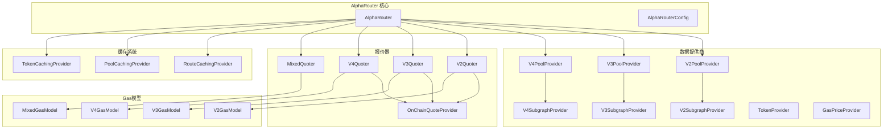

# Smart Order Router 源码深度分析

## 概述

`@uniswap/smart-order-router` 是 Uniswap 聚合器的核心算法库，包含了智能路由、价格发现、Gas优化等核心功能。通过深入分析其源码，我们可以学习到：

1. **路由算法的具体实现**
2. **多协议池数据获取与管理**
3. **Gas费用估算和优化策略**
4. **缓存机制的设计模式**
5. **链上数据同步与处理**

## 核心架构

### 🧠 AlphaRouter - 主路由引擎

AlphaRouter 是整个系统的核心，协调各个子模块工作：

```typescript
// 从 alpha-router.d.ts 分析得出的核心结构
export declare class AlphaRouter implements IRouter<AlphaRouterConfig> {
  
  constructor(params: AlphaRouterParams);
  
  // 核心路由方法
  route(
    amount: CurrencyAmount,
    quoteCurrency: Currency, 
    tradeType: TradeType,
    swapConfig?: SwapOptions,
    partialRoutingConfig?: Partial<AlphaRouterConfig>
  ): Promise<SwapRoute | null>;
  
  // 流动性比例路由
  routeToRatio(
    token0Balance: CurrencyAmount,
    token1Balance: CurrencyAmount,
    position: Position,
    swapAndAddConfig: SwapAndAddConfig,
    swapAndAddOptions?: SwapAndAddOptions,
    routingConfig?: Partial<AlphaRouterConfig>
  ): Promise<SwapToRatioResponse>;
}
```

### 🔧 核心组件依赖



## 路由算法核心

### 🎯 路由选择策略

```typescript
// 根据 alpha-router.d.ts 分析的池选择配置
export declare type ProtocolPoolSelection = {
  // 按TVL排序的前N个池子
  topN: number;
  
  // tokenIn-tokenOut 直接交易对的前N个池子
  topNDirectSwaps: number;
  
  // 包含 tokenIn 或 tokenOut 的前N个池子
  topNTokenInOut: number;
  
  // 二跳路由的池子数量
  topNSecondHop: number;
  
  // 与指定基础代币配对的池子数量
  topNWithEachBaseToken: number;
  topNWithBaseToken: number;
};

// 完整的路由配置
export declare type AlphaRouterConfig = {
  // V2、V3、V4 协议的池选择配置
  v2PoolSelection: ProtocolPoolSelection;
  v3PoolSelection: ProtocolPoolSelection;
  v4PoolSelection: ProtocolPoolSelection;
  
  // 路径搜索配置
  maxSwapsPerPath: number;      // 每条路径最大跳数
  minSplits: number;            // 最小路径拆分数
  maxSplits: number;            // 最大路径拆分数
  distributionPercent: number;  // 分配百分比
  
  // 协议组合策略
  forceCrossProtocol: boolean;  // 强制跨协议路由
  
  // 缓存配置
  cacheMode?: CacheMode;
  writeToCachedRoutes?: boolean;
  
  // 意图驱动配置
  intent?: INTENT;
};
```

### 📊 路由评分机制

从源码结构可以推断路由评分考虑以下因素：

```typescript
// 路由评分要素
interface RouteEvaluation {
  // 输出金额（越大越好）
  outputAmount: CurrencyAmount;
  
  // Gas费用（越小越好）
  gasEstimate: CurrencyAmount;
  
  // 价格影响（越小越好）
  priceImpact: number;
  
  // 流动性深度
  liquidityDepth: number;
  
  // 路径复杂度惩罚
  pathComplexityPenalty: number;
  
  // 协议可靠性权重
  protocolReliabilityWeight: number;
}

// 综合评分计算
function calculateRouteScore(route: RouteEvaluation): number {
  const outputScore = route.outputAmount.toNumber();
  const gasPenalty = route.gasEstimate.toNumber();
  const impactPenalty = route.priceImpact * IMPACT_PENALTY_FACTOR;
  const complexityPenalty = route.pathComplexityPenalty;
  
  return (outputScore * route.protocolReliabilityWeight) 
         - gasPenalty 
         - impactPenalty 
         - complexityPenalty;
}
```

## 数据提供商系统

### 🏊‍♂️ 池数据提供商

#### V3PoolProvider
```typescript
// V3 池数据获取接口
export interface IV3PoolProvider {
  getPools(
    tokenPairs: [Token, Token][],
    providerConfig?: ProviderConfig
  ): Promise<V3PoolAccessor>;
  
  getPoolAddress(
    tokenA: Token,
    tokenB: Token,
    feeAmount: FeeAmount
  ): { poolAddress: string; token0: Token; token1: Token };
}

// 支持的费率档位
enum FeeAmount {
  LOWEST = 100,     // 0.01%
  LOW = 500,        // 0.05% 
  MEDIUM = 3000,    // 0.3%
  HIGH = 10000,     // 1%
}
```

#### V4PoolProvider
```typescript
// V4 池数据（支持钩子）
export interface IV4PoolProvider {
  getPools(
    tokenPairs: [Token, Token][],
    providerConfig?: ProviderConfig
  ): Promise<V4PoolAccessor>;
  
  // V4 特有的钩子支持
  getPoolsWithHooks(
    tokenPairs: [Token, Token][],
    hooksOptions: HooksOptions,
    providerConfig?: ProviderConfig
  ): Promise<V4PoolAccessor>;
}

// 钩子配置选项
export interface HooksOptions {
  beforeSwap?: boolean;
  afterSwap?: boolean;
  beforeAddLiquidity?: boolean;
  afterAddLiquidity?: boolean;
  beforeRemoveLiquidity?: boolean;
  afterRemoveLiquidity?: boolean;
  beforeDonate?: boolean;
  afterDonate?: boolean;
}
```

### 📈 Subgraph 数据同步

```typescript
// Subgraph 数据提供商接口
export interface ISubgraphProvider<TSubgraphPool> {
  getPools(
    tokenIn?: Token,
    tokenOut?: Token,
    providerConfig?: ProviderConfig
  ): Promise<TSubgraphPool[]>;
}

// V3 Subgraph 池数据
export interface V3SubgraphPool {
  id: string;
  token0: Token;
  token1: Token;
  feeTier: string;
  liquidity: string;
  sqrtPrice: string;
  tick: string;
  tvlETH: number;
  tvlUSD: number;
}

// 带回退的 Subgraph 提供商
export class SubgraphProviderWithFallback<TSubgraphPool> implements ISubgraphProvider<TSubgraphPool> {
  constructor(
    private fallbacks: ISubgraphProvider<TSubgraphPool>[]
  ) {}
  
  async getPools(
    tokenIn?: Token,
    tokenOut?: Token,
    providerConfig?: ProviderConfig
  ): Promise<TSubgraphPool[]> {
    for (const provider of this.fallbacks) {
      try {
        return await provider.getPools(tokenIn, tokenOut, providerConfig);
      } catch (error) {
        // 记录错误，尝试下一个提供商
        log.warn({ error }, 'Subgraph provider failed, trying next fallback');
        continue;
      }
    }
    throw new Error('All subgraph providers failed');
  }
}
```

## 链上报价系统

### 💰 OnChainQuoteProvider

```typescript
// 链上报价提供商
export interface IOnChainQuoteProvider {
  getQuotesManyExactIn(
    amountIns: CurrencyAmount[],
    routes: Route[]
  ): Promise<{
    blockNumber: BigNumber;
    results: Array<{
      success: boolean;
      quotedAmount?: CurrencyAmount;
      gasEstimate?: BigNumber;
    }>;
  }>;
  
  getQuotesManyExactOut(
    amountOuts: CurrencyAmount[],
    routes: Route[]
  ): Promise<{
    blockNumber: BigNumber;
    results: Array<{
      success: boolean;
      quotedAmount?: CurrencyAmount;
      gasEstimate?: BigNumber;
    }>;
  }>;
}

// 批量报价优化
export class OnChainQuoteProvider implements IOnChainQuoteProvider {
  constructor(
    private chainId: ChainId,
    private provider: BaseProvider,
    private multicallProvider: UniswapMulticallProvider,
    private retryOptions?: RetryOptions,
    private batchParams?: {
      multicallChunk: number;      // 每次multicall的调用数量
      gasLimitPerCall: number;     // 每次调用的Gas限制
      quoteMinSuccessRate: number; // 最小成功率
    }
  ) {}
}
```

### ⚡ 报价器 (Quoters)

```typescript
// V3 报价器
export class V3Quoter {
  constructor(
    private v3PoolProvider: IV3PoolProvider,
    private onChainQuoteProvider: IOnChainQuoteProvider,
    private tokenProvider: ITokenProvider
  ) {}
  
  async getRoutesThenQuotes(
    tokenIn: Token,
    tokenOut: Token,
    amount: CurrencyAmount,
    percents: number[],
    quoteToken: Token,
    v3GasModel: IG3GasModelFactory,
    swapConfig: SwapOptions,
    routingConfig: AlphaRouterConfig
  ): Promise<{
    routesWithValidQuotes: V3RouteWithValidQuote[];
    candidatePools: V3Pool[];
  }>;
}

// 混合报价器（跨协议）
export class MixedQuoter {
  constructor(
    private v2PoolProvider: IV2PoolProvider,
    private v3PoolProvider: IV3PoolProvider,
    private v4PoolProvider: IV4PoolProvider,
    private onChainQuoteProvider: IOnChainQuoteProvider
  ) {}
  
  async getRoutesThenQuotes(
    tokenIn: Token,
    tokenOut: Token,
    amount: CurrencyAmount,
    percents: number[],
    quoteToken: Token,
    gasModels: {
      v2GasModel: IV2GasModelFactory;
      v3GasModel: IG3GasModelFactory;
      v4GasModel: IG4GasModelFactory;
      mixedGasModel: IMixedGasModelFactory;
    },
    swapConfig: SwapOptions,
    routingConfig: AlphaRouterConfig
  ): Promise<{
    routesWithValidQuotes: MixedRouteWithValidQuote[];
    candidatePools: Array<V2Pool | V3Pool | V4Pool>;
  }>;
}
```

## Gas费用建模

### ⛽ Gas模型工厂

```typescript
// Gas模型接口
export interface IOnChainGasModelFactory<T extends RouteWithValidQuote> {
  buildGasModel(
    chainId: ChainId,
    gasPriceWei: BigNumber,
    poolProvider: IPoolProvider,
    token: Token,
    l2GasDataProvider?: IL2GasDataProvider,
    providerConfig?: ProviderConfig
  ): Promise<IOnChainGasModel<T>>;
}

// Gas费用估算
export interface IOnChainGasModel<T extends RouteWithValidQuote> {
  estimateGasCost(route: T): {
    gasEstimate: BigNumber;
    gasCostInToken: CurrencyAmount;
    gasCostInUSD: CurrencyAmount;
  };
}

// V3 特定的Gas模型
export class V3HeuristicGasModelFactory implements IOnChainGasModelFactory<V3RouteWithValidQuote> {
  async buildGasModel(
    chainId: ChainId,
    gasPriceWei: BigNumber,
    poolProvider: IV3PoolProvider,
    token: Token
  ): Promise<IV3GasModel> {
    // 基础Gas消耗
    const BASE_SWAP_COST = BigNumber.from(135000);
    
    // Tick crossing 成本
    const COST_PER_INIT_TICK = BigNumber.from(31000);
    const COST_PER_HOP = BigNumber.from(80000);
    
    return new V3HeuristicGasModel(
      gasPriceWei,
      BASE_SWAP_COST,
      COST_PER_INIT_TICK,
      COST_PER_HOP,
      token
    );
  }
}
```

## 缓存机制

### 🗂️ 路由缓存

```typescript
// 路由缓存接口
export interface IRouteCachingProvider {
  getCachedRoute(
    chainId: ChainId,
    amount: CurrencyAmount,
    quoteToken: Token,
    tradeType: TradeType,
    protocols: Protocol[],
    blockNumber: number,
    optimistic: boolean
  ): Promise<CachedRoutes | undefined>;
  
  setCachedRoute(
    cachedRoutes: CachedRoutes,
    amount: CurrencyAmount
  ): Promise<boolean>;
}

// 缓存的路由数据
export class CachedRoutes {
  constructor(
    public routes: CachedRoute[],
    public chainId: ChainId,
    public currencyIn: Currency,
    public currencyOut: Currency,
    public protocolsCovered: Protocol[],
    public blockNumber: number,
    public tradeType: TradeType,
    public originalAmount: string,
    public blocksToLive: number
  ) {}
}

// 单个缓存路由
export class CachedRoute {
  constructor(
    public route: Route,
    public percent: number
  ) {}
}
```

### 💾 池缓存提供商

```typescript
// V3 池缓存
export class CachingV3PoolProvider implements IV3PoolProvider {
  constructor(
    private poolProvider: IV3PoolProvider,
    private cache: ICache<V3Pool[]>,
    private cacheKey: (tokenA: Token, tokenB: Token, feeAmount: FeeAmount) => string
  ) {}
  
  async getPools(
    tokenPairs: [Token, Token][],
    providerConfig?: ProviderConfig
  ): Promise<V3PoolAccessor> {
    const cachedPools = new Map<string, V3Pool>();
    const missingPairs: [Token, Token][] = [];
    
    // 检查缓存
    for (const [tokenA, tokenB] of tokenPairs) {
      for (const feeAmount of FEE_AMOUNTS) {
        const cacheKey = this.cacheKey(tokenA, tokenB, feeAmount);
        const cachedPool = await this.cache.get(cacheKey);
        
        if (cachedPool) {
          cachedPools.set(cacheKey, cachedPool);
        } else {
          missingPairs.push([tokenA, tokenB]);
        }
      }
    }
    
    // 获取缺失的池数据
    if (missingPairs.length > 0) {
      const freshPools = await this.poolProvider.getPools(missingPairs, providerConfig);
      
      // 更新缓存
      for (const [key, pool] of freshPools.getAllPools()) {
        await this.cache.set(key, pool, POOL_CACHE_TTL);
        cachedPools.set(key, pool);
      }
    }
    
    return new V3PoolAccessor(cachedPools);
  }
}
```

## 性能优化策略

### 🚀 并发处理

```typescript
// 并发获取路由报价
export class ConcurrentQuoteProcessor {
  async processQuotes(
    routes: Route[],
    amounts: CurrencyAmount[],
    concurrency: number = 10
  ): Promise<QuoteResult[]> {
    const chunks = this.chunkArray(routes, concurrency);
    const results: QuoteResult[] = [];
    
    for (const chunk of chunks) {
      const chunkPromises = chunk.map(route => 
        this.getQuoteForRoute(route, amounts)
      );
      
      const chunkResults = await Promise.allSettled(chunkPromises);
      
      chunkResults.forEach((result, index) => {
        if (result.status === 'fulfilled') {
          results.push(result.value);
        } else {
          log.warn({ 
            route: chunk[index], 
            error: result.reason 
          }, 'Quote failed for route');
        }
      });
    }
    
    return results;
  }
  
  private chunkArray<T>(array: T[], chunkSize: number): T[][] {
    const chunks: T[][] = [];
    for (let i = 0; i < array.length; i += chunkSize) {
      chunks.push(array.slice(i, i + chunkSize));
    }
    return chunks;
  }
}
```

### ⚡ 重试机制

```typescript
// 智能重试策略
export class RetryProvider<T> {
  constructor(
    private provider: () => Promise<T>,
    private retryOptions: {
      retries: number;
      minTimeout: number;
      maxTimeout: number;
      randomize: boolean;
      onRetry?: (error: Error, attempt: number) => void;
    }
  ) {}
  
  async execute(): Promise<T> {
    let lastError: Error;
    
    for (let attempt = 0; attempt <= this.retryOptions.retries; attempt++) {
      try {
        return await this.provider();
      } catch (error) {
        lastError = error as Error;
        
        if (attempt === this.retryOptions.retries) {
          throw lastError;
        }
        
        // 指数退避
        const timeout = Math.min(
          this.retryOptions.minTimeout * Math.pow(2, attempt),
          this.retryOptions.maxTimeout
        );
        
        const jitteredTimeout = this.retryOptions.randomize
          ? timeout * (0.5 + Math.random() * 0.5)
          : timeout;
        
        this.retryOptions.onRetry?.(lastError, attempt + 1);
        await this.delay(jitteredTimeout);
      }
    }
    
    throw lastError!;
  }
  
  private delay(ms: number): Promise<void> {
    return new Promise(resolve => setTimeout(resolve, ms));
  }
}
```

## 学习要点总结

### 🎯 关键设计模式

1. **提供商模式**: 所有数据获取都通过提供商接口，支持不同实现和缓存
2. **工厂模式**: Gas模型、报价器等都使用工厂模式创建
3. **策略模式**: 不同协议有不同的路由策略和Gas模型
4. **观察者模式**: 通过回调和事件处理异步操作
5. **装饰器模式**: 缓存、重试等功能通过装饰器模式添加

### 🔧 核心技术要点

1. **多协议聚合**: 统一抽象不同AMM协议的差异
2. **智能路径搜索**: 基于图算法的最优路径发现
3. **Gas费用优化**: 精确的Gas模型和成本估算
4. **并发处理**: 高效的批量操作和并发控制
5. **错误恢复**: 完善的重试和降级机制

### 📚 进一步学习方向

1. **深入特定协议**: 详细学习V2、V3、V4的具体实现差异
2. **Gas优化技巧**: 研究不同链上的Gas优化策略
3. **缓存设计**: 学习多层缓存和失效策略
4. **性能调优**: 并发控制、内存管理、网络优化
5. **错误处理**: 异常处理和系统稳定性设计

---

**下一节**: [路由算法具体实现分析](./02-路由算法具体实现分析.md)
