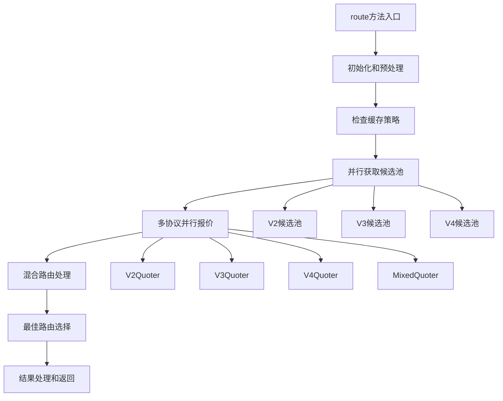

# Uniswap Smart-Order-Router 核心算法学习总结

## 🎯 学习目标回顾

通过深入分析 `@uniswap/smart-order-router` 包的源码，我们已经完成了以下学习目标：

✅ **理解核心架构**: 掌握了 AlphaRouter 的整体设计和组件关系  
✅ **分析路由算法**: 深入学习了多协议并行路由查找机制  
✅ **掌握优化策略**: 理解了 BFS 最佳路由选择算法  
✅ **实践指南**: 创建了完整的自定义聚合器开发指南  

## 📋 核心技术要点总结

### 1. AlphaRouter 核心架构

#### 主要组件构成
```typescript
class AlphaRouter {
  // 核心提供者
  tokenProvider: ITokenProvider;
  v2PoolProvider: IV2PoolProvider;
  v3PoolProvider: IV3PoolProvider;
  v4PoolProvider: IV4PoolProvider;
  
  // 报价器
  v2Quoter: IV2Quoter;
  v3Quoter: IV3Quoter;
  v4Quoter: IV4Quoter;
  mixedQuoter: IMixedQuoter;
  
  // Gas 模型
  v2GasModel: IV2GasModel;
  v3GasModel: IV3GasModel;
  v4GasModel: IV4GasModel;
  
  // 缓存和其他服务
  routeCachingProvider: IRouteCachingProvider;
  tokenPropertiesProvider: ITokenPropertiesProvider;
  portionProvider: IPortionProvider;
}
```

#### 核心接口设计
- **IQuoter**: 各协议的报价接口，统一了 V2/V3/V4 的报价逻辑
- **IGasModel**: Gas 估算接口，支持不同协议的 Gas 计算
- **IPoolProvider**: 池子数据提供接口，支持多数据源
- **IRouteCachingProvider**: 路由缓存接口，提升查询性能

### 2. 核心路由算法流程

#### 主要算法步骤


#### 关键算法特性
1. **并行处理**: 所有协议的池子获取和报价计算都是并行执行
2. **智能缓存**: 支持多种缓存模式（Livemode、Darkmode、Tapcompare）
3. **Gas 优化**: 考虑 L1+L2 Gas 费用的综合优化
4. **协议兼容**: 智能处理不同路由器版本的协议支持

### 3. 最佳路由选择算法（BFS）

#### 算法核心思想
- **路由拆分**: 将大额交易拆分为多个小额交易以获得更好价格
- **广度优先搜索**: 系统性地探索所有可能的路由组合
- **池子去重**: 避免在同一池子中重复交易以保证报价准确性

#### 算法实现要点
```typescript
// 核心 BFS 循环
while (queue.size > 0) {
  let layer = queue.size;
  splits++;
  
  // 早期终止条件
  if (splits >= 3 && bestSwap && bestSwap.length < splits - 1) {
    break;
  }
  
  while (layer > 0) {
    const { remainingPercent, curRoutes, percentIndex } = queue.dequeue();
    
    for (let i = percentIndex; i >= 0; i--) {
      const percentA = percents[i];
      if (percentA > remainingPercent) continue;
      
      // 找到不重用池子的最佳路由
      const routeWithQuoteA = findFirstRouteNotUsingUsedPools(
        curRoutes, candidateRoutesA, forceCrossProtocol
      );
      
      if (routeWithQuoteA) {
        const curRoutesNew = [...curRoutes, routeWithQuoteA];
        
        if (remainingPercentNew == 0 && splits >= minSplits) {
          // 找到完整路由，更新最佳结果
          updateBestRoute(curRoutesNew);
        } else {
          // 继续搜索
          queue.enqueue({ curRoutes: curRoutesNew, ... });
        }
      }
    }
  }
}
```

### 4. 性能优化策略

#### 缓存机制
- **路由缓存**: 缓存计算结果，提高响应速度
- **池子缓存**: 缓存池子数据，减少链上查询
- **Token 缓存**: 缓存代币信息，避免重复获取

#### 并行优化
- **候选池并行获取**: 同时从多个协议获取候选池
- **报价并行计算**: 并行计算各协议的报价
- **Gas 模型并行**: 并行计算不同协议的 Gas 费用

#### 搜索优化
- **早期终止**: 当增加拆分不能改善结果时提前终止
- **搜索空间控制**: 限制最大拆分数量和搜索深度
- **内存管理**: 使用固定大小的堆控制内存使用

## 🛠️ 自定义聚合器开发要点

### 1. 核心技术栈
```json
{
  "dependencies": {
    "@uniswap/smart-order-router": "^4.22.20",
    "@uniswap/sdk-core": "^4.x",
    "@uniswap/v2-sdk": "^3.x",
    "@uniswap/v3-sdk": "^3.x",
    "@uniswap/router-sdk": "^1.x",
    "ethers": "^5.x"
  }
}
```

### 2. 基础架构实现
```typescript
class MyAggregator {
  private router: AlphaRouter;
  private provider: JsonRpcProvider;
  
  constructor(config: AggregatorConfig) {
    this.provider = new JsonRpcProvider(config.rpcUrl);
    this.router = new AlphaRouter({
      chainId: config.chainId,
      provider: this.provider,
    });
  }
  
  async getQuote(tokenIn: Token, tokenOut: Token, amountIn: string) {
    const amount = CurrencyAmount.fromRawAmount(tokenIn, amountIn);
    const route = await this.router.route(amount, tokenOut, TradeType.EXACT_INPUT);
    return this.formatQuote(route);
  }
}
```

### 3. 扩展机会
1. **协议扩展**: 添加对更多 DEX 协议的支持
2. **跨链支持**: 实现跨链桥接功能
3. **高级功能**: 限价单、DCA、MEV 保护等
4. **用户界面**: 构建 Web 或移动端界面

## 📊 实际应用场景

### 1. 个人交易工具
- 为个人用户提供最优交易路径
- 减少滑点和交易成本
- 支持批量交易操作

### 2. DeFi 协议集成
- 为其他 DeFi 协议提供交易功能
- 作为基础设施被其他应用调用
- 实现复杂的交易策略

### 3. 套利和 MEV
- 发现跨协议套利机会
- 实现自动化套利策略
- MEV 搜索和提取

### 4. 流动性管理
- LP 头寸管理工具
- 自动再平衡策略
- 收益优化算法

## 🔍 深入学习建议

### 1. 源码深入研究
- 继续阅读 `getRoutesThenQuotes` 方法实现
- 研究各协议 Quoter 的具体实现
- 学习 Gas 模型的详细计算逻辑

### 2. 实践项目
- 从简单的报价功能开始
- 逐步添加路由拆分功能
- 实现自定义协议支持

### 3. 性能优化
- 研究缓存策略的最佳实践
- 优化网络请求和并发处理
- 监控和调优系统性能

### 4. 生产部署
- 学习 AWS 基础设施搭建
- 实现监控和告警系统
- 掌握运维和故障处理

## 📚 相关资源

### 官方文档
- [Uniswap Documentation](https://docs.uniswap.org/)
- [Smart Order Router GitHub](https://github.com/Uniswap/smart-order-router)
- [Routing API GitHub](https://github.com/Uniswap/routing-api)

### 技术文章
- [Uniswap Labs Blog](https://blog.uniswap.org/)
- [Understanding AMM Mechanics](https://research.paradigm.xyz/)
- [MEV and DEX Aggregators](https://www.mev.wiki/)

### 开发工具
- [Tenderly Simulation](https://tenderly.co/)
- [The Graph Protocol](https://thegraph.com/)
- [Infura/Alchemy RPC](https://infura.io/)

## 🎯 下一步行动计划

1. **✅ 已完成**: 
   - 理解 Smart-Order-Router 核心架构
   - 分析核心路由算法实现
   - 掌握最佳路由选择策略
   - 创建自定义聚合器开发指南

2. **🔄 进行中**:
   - 深入研究各协议 Quoter 实现
   - 分析 Gas 模型计算逻辑
   - 学习缓存策略优化

3. **📋 待完成**:
   - 实现完整的自定义聚合器原型
   - 添加对更多 DEX 协议的支持
   - 构建用户界面和 API 服务
   - 部署到生产环境并进行测试

通过这次深入的源码分析，我们已经具备了构建自定义聚合器的核心技术基础。现在可以开始实际的开发工作，将理论知识转化为实际的代码实现！
